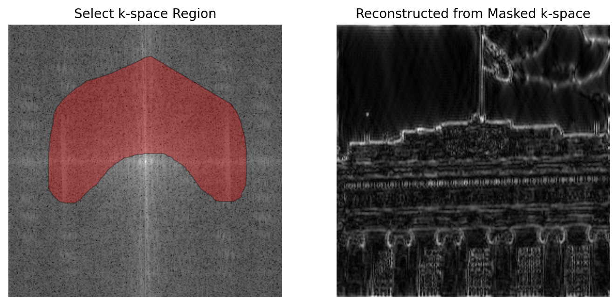

# K-Space Explorer
The GUI presented here primarily functions as a learning tool to explore the relationsihp between the K- and Image- space.

## Background
coming soon

## Usage
Currently, the GUI is implemented in the [k_space_explorer notebook](./k_space_explorer.ipynb) with [ipywidgets](https://ipywidgets.readthedocs.io/en/stable/).

1. **Open the GUI** by simply running the notebook
2. **Upload an image** by pressing "Upload"
   - If the image is uploaded correctly, the button will read "Upload (1)"
3. **Compute the K-Space** representation of the image by pressing "Process Image"
   - The K-Space will be displayed on the left
4. **Draw a mask** on the K-Space
5. **The reconstructed image** corresponding to the selected K-Space area is automatically shown on the right

### Example


## Dependencies
All dependencies are listed in [```requirements.txt```](./requirements.txt)

Install using pip: ```pip install -r /path/to/requirements.txt```
